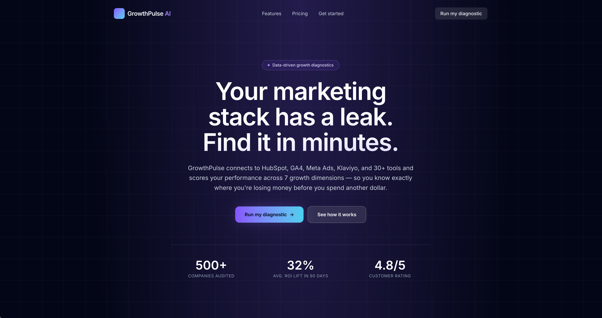
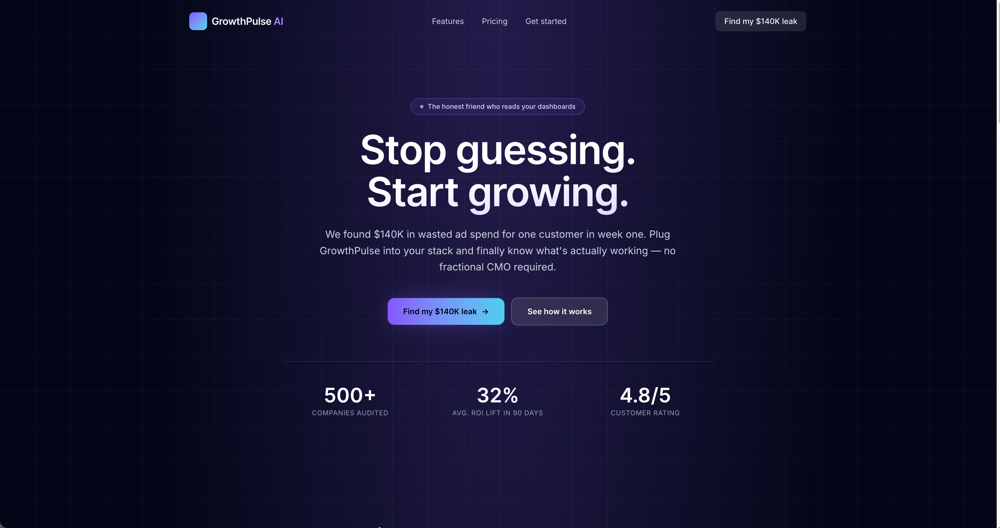
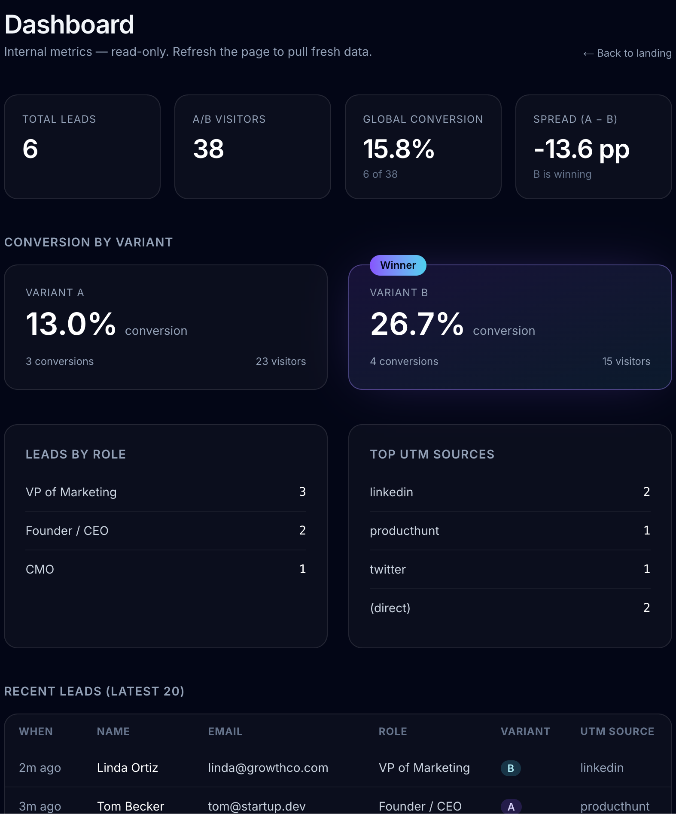
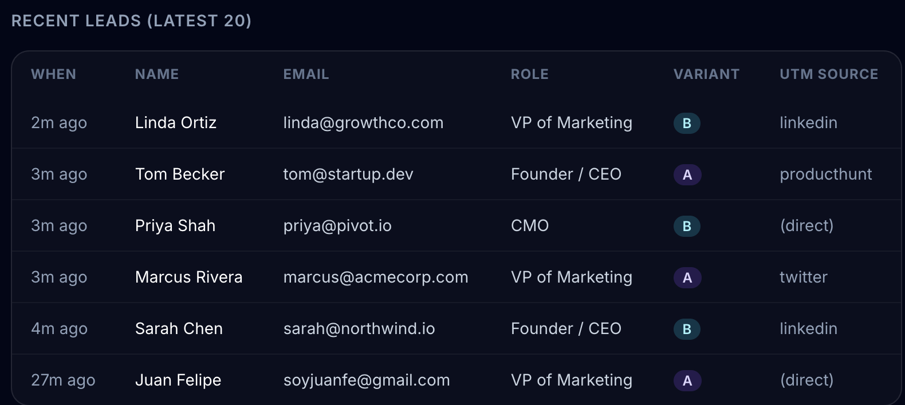

# GrowthPulse AI

> The honest friend who reads your dashboards.

A landing + lead capture system for **GrowthPulse AI**, a (fictional) SaaS that connects a marketing stack and delivers a 7-dimension growth diagnostic. Built as the technical assessment for Azarian Growth Agency.

| | |
|---|---|
| **Live demo** | https://growthpulse-ai-seven.vercel.app |
| **Internal dashboard** | https://growthpulse-ai-seven.vercel.app/dashboard?password=azarianJuanFe |
| **Repo** | https://github.com/juanfecode/growthpulse-ai |
| **Stack** | Next.js 16 · TypeScript · Tailwind v4 · Prisma v7 · Supabase Postgres · PostHog · Playwright · Vercel |

---

## For reviewers

Submit the form on the landing page → the lead is persisted, the matching A/B assignment is flipped to `converted`, and the entry shows up immediately in the dashboard above. The dashboard is read-only and password-gated; the password is shared in the table above so you can open it directly.

You'll see total leads, conversion rate by variant (with a "winner" badge once one variant is more than 5 percentage points ahead), breakdowns by role and UTM source, and the latest 20 submissions. The query-param auth is intentionally simple — listed as a documented trade-off below.

---

## Screenshots

**Landing — variant A** (rational angle: "Your marketing stack has a leak")


**Landing — variant B** (emotional angle: "Stop guessing. Start growing.")


**Dashboard — KPIs and conversion by variant** (B is winning at the time of capture, +13.6 pp over A)


**Dashboard — recent leads table**


---

## What's built

| Capability | Where it lives |
|---|---|
| Landing page (5 sections, A/B variants) | `app/page.tsx` + `components/landing/*` + `lib/landing-content.ts` |
| Lead capture form | `components/forms/LeadForm.tsx` |
| Lead API (validation + insert + conversion tracking) | `app/api/leads/route.ts` |
| Personalized thank-you page | `app/thank-you/page.tsx` |
| A/B testing (deterministic 50/50 via middleware) | `lib/ab-testing.ts` + `middleware.ts` |
| UTM parsing | `lib/utm.ts` |
| PostHog tracking (browser + server) | `lib/posthog.ts` + `lib/posthog-server.ts` + `components/providers/PostHogProvider.tsx` |
| Internal metrics dashboard | `app/dashboard/page.tsx` + `lib/dashboard-metrics.ts` |
| RLS hardening | `prisma/sql/enable_rls.sql` |
| Playwright E2E tests (9 specs) | `tests/*.spec.ts` |
| Health check | `app/api/health/route.ts` |

---

## Architecture — the four decisions worth explaining

### 1. A/B testing is deterministic, not random

`Math.random() < 0.5` biases hard at low traffic — with 20 visitors you can easily end up 14/6. Instead, on every first visit the middleware queries `SELECT COUNT(*) FROM ab_assignments`. Even count → variant A. Odd count → variant B. Then it inserts a new row. Result: an exact `A,B,A,B,…` sequence — 50/50 guaranteed regardless of traffic.

```ts
// lib/ab-testing.ts
export async function assignNextAssignment(): Promise<Assignment> {
  const count = await prisma.abAssignment.count();
  const variant: AbVariant = count % 2 === 0 ? "A" : "B";
  return prisma.abAssignment.create({
    data: { variant },
    select: { id: true, variant: true },
  });
}
```

### 2. The cookie stores the row id, not just the variant

The naive approach is to store `gp_variant=A` in a cookie and, on conversion, run `UPDATE ab_assignments SET converted=true WHERE variant='A' AND converted=false`. **That marks every visitor in variant A as converted** — a bug that destroys the conversion rate.

The fix is two cookies: `gp_variant` (for the UI) and `gp_assignment` (the row UUID). Conversion is `UPDATE … WHERE id=…`, so each visitor flips their own row exactly once.

### 3. Middleware runs on Node, not Edge

Prisma can't run on Vercel's Edge runtime. The two options are (a) Prisma Data Proxy (slow, paid) or (b) `export const config = { runtime: "nodejs" }`. Option (b) — supported in Next 15+, minimal latency overhead, free.

### 4. RLS even though we use Prisma

Prisma connects as the `postgres` super-user, so it bypasses RLS — every Prisma query works. **But Supabase also exposes a public REST API at `/rest/v1/leads` using the `anon` key that ships in the browser bundle.** Without RLS, anyone could `fetch()` that endpoint from DevTools and exfiltrate every lead.

`prisma/sql/enable_rls.sql` enables RLS on `leads` and `ab_assignments` with **zero policies for `anon`**, fully blocking the REST surface. Prisma server-side keeps working because it connects as super-user. Defense in depth.

---

## Technical challenges that took real time

The interesting bugs and the workarounds, in chronological order.

**1. Prisma v7 ≠ Prisma v6.** The `@prisma/adapter-pg` adapter is now mandatory; the `datasource` block in `schema.prisma` no longer takes a `url` (it's passed to the adapter in code); `previewFeatures = ["driverAdapters"]` is removed; `prisma.config.ts` (new in v7) must point at the **direct** connection (port 5432), not the pooled one. None of this is in older tutorials. The fix is in `lib/prisma.ts` and `prisma.config.ts`.

**2. Supabase pooler TLS validation.** Vercel functions failed with `Error opening a TLS connection: self-signed certificate in certificate chain` against Supabase's pooler. Node's default CA bundle doesn't trust Supabase's chain. The connection string ships with `sslmode=require` which forces full verification — `lib/prisma.ts` rewrites it to `sslmode=no-verify` at runtime. Encryption is preserved; only CA validation is skipped. Production at scale would bundle Supabase's `prod-ca-2021.crt`.

**3. Vercel ↔ Supabase env var naming.** The official Vercel-Supabase integration auto-injects `POSTGRES_PRISMA_URL` and `POSTGRES_URL_NON_POOLING`, not `DATABASE_URL` / `DIRECT_URL`. First production deploy crashed with `Can't reach database server at 127.0.0.1:5432` because Prisma fell back to its default. Fixed by reading the integration var first with a local `.env` fallback so dev still works.

**4. Vercel build was missing the Prisma client.** `prisma generate` doesn't run on Vercel by default. The build crashed importing types from `@/lib/generated/prisma`. Fixed in `package.json`: both `postinstall` and `build` run `prisma generate`.

**5. Next.js 16 made `searchParams` a Promise.** Quietly breaks the dashboard and `/thank-you` if you treat it like the old object. Both pages now `await` it.

**6. Honeypot was actually broken — caught by tests.** The `lib/validation.ts` schema had `website: z.string().max(0)`, so when a bot filled the field, **zod rejected the whole request with 400 before the route handler could return its silent fake-200**. Bots would then retry, defeating the honeypot. Found because the Playwright spec for `/api/leads` expected 200 and got 400. Loosened to `z.string().optional()` so the runtime check in the route handler is the only gate.

---

## Data flow: a lead from click to dashboard

```
User lands on / with ?utm_source=linkedin
        │
        ▼
middleware.ts (Node runtime)
  • reads gp_variant + gp_assignment cookies
  • if missing: assignNextAssignment() → INSERT ab_assignments → set both cookies
        │
        ▼
app/page.tsx (Server Component)
  • reads gp_variant cookie → picks HERO_VARIANTS[A|B]
  • renders the 5 landing sections
        │
        ▼ (user fills form)
components/forms/LeadForm.tsx ("use client")
  • parseUtmParams(window.location.search)
  • posthog.capture("form_started") on first keystroke
  • POST /api/leads { name, email, role, website (honeypot), utm* }
        │
        ▼
app/api/leads/route.ts (Node runtime)
  • leadSchema.safeParse(body)         ← zod validation
  • if honeypot.website filled → fake 200, no insert
  • prisma.lead.create({ ... abVariant from cookie })
  • markConverted(assignmentId)        ← flips ab_assignments.converted
  • posthogServer.capture("lead_submitted", { distinctId: email })
        │
        ▼
LeadForm
  • posthog.identify(email, { role })  ← anonymous → person profile
  • router.push(`/thank-you?role=${role}`)
        │
        ▼
app/thank-you/page.tsx (Server Component)
  • reads ?role= from searchParams (Promise in Next 16)
  • renders role-specific copy (Founder / VPMarketing / CMO / Otro)
```

---

## PostHog: two SDKs, one project

| SDK | File | Runs in | Fires |
|---|---|---|---|
| `posthog-js` | `lib/posthog.ts` + `components/providers/PostHogProvider.tsx` | Browser | `form_started`, `form_error`, `lead_submitted_client`, `identify(email)` |
| `posthog-node` | `lib/posthog-server.ts` | Node runtime (API route) | `lead_submitted` |

The browser SDK calls `identify(email)` to link the anonymous visitor to a person profile. The server SDK fires `lead_submitted` from inside `/api/leads` after the DB insert succeeds — that's the source of truth, because the browser event can be lost if the user closes the tab. Both clients read the same project key from `NEXT_PUBLIC_POSTHOG_KEY`. We use `person_profiles: "identified_only"` to keep PostHog's bill sane (anonymous visitors share a bucket).

---

## Tests

`tests/` contains 9 Playwright specs across 3 files. Run with `npm run test:e2e` (assumes `npm run dev` is up in another terminal).

| Spec | What it covers |
|---|---|
| `tests/landing.spec.ts` | Happy path: visit `/` → see features + pricing → fill form → assert redirect to `/thank-you?role=Founder` with personalized copy. Plus client validation rejecting a bad email. |
| `tests/api-leads.spec.ts` | `POST /api/leads` contract: invalid email → 400 + `errors.email`, missing role → 400, honeypot filled → silent 200, valid payload → 200 + role echoed. |
| `tests/dashboard.spec.ts` | Auth gate: no password → password prompt; wrong password → "Wrong password" error; correct password → metrics shell renders. |

The test suite found a real bug (see Technical Challenges #6).

---

## Schema

```prisma
model Lead {
  id          String    @id @default(uuid()) @db.Uuid
  name        String
  email       String
  role        Role
  abVariant   AbVariant @map("ab_variant")
  utmSource   String?   @map("utm_source")
  utmMedium   String?   @map("utm_medium")
  utmCampaign String?   @map("utm_campaign")
  utmTerm     String?   @map("utm_term")
  utmContent  String?   @map("utm_content")
  createdAt   DateTime  @default(now()) @map("created_at") @db.Timestamptz(6)
  @@map("leads")
}

model AbAssignment {
  id        String    @id @default(uuid()) @db.Uuid
  variant   AbVariant
  converted Boolean   @default(false)
  createdAt DateTime  @default(now()) @map("created_at") @db.Timestamptz(6)
  @@map("ab_assignments")
}

enum Role     { Founder VPMarketing CMO Otro }
enum AbVariant { A B }
```

---

## Setup

```bash
git clone git@github.com:juanfecode/growthpulse-ai.git
cd growthpulse-ai
npm install                    # runs prisma generate via postinstall

# create .env with the variables below
cp .env.example .env           # then fill in real values

npx prisma migrate deploy      # apply the migration to your Supabase DB

# one-time: enable RLS in Supabase SQL Editor by pasting prisma/sql/enable_rls.sql

npm run dev                    # http://localhost:3000
curl localhost:3000/api/health # → {"ok":true,"db":"connected",...}

# (optional) end-to-end tests in another terminal
npm run test:e2e
```

### Required environment variables

```bash
# Supabase Postgres — pooler (port 6543) for runtime, direct (5432) for migrations
DATABASE_URL=postgresql://...:6543/postgres?pgbouncer=true
DIRECT_URL=postgresql://...:5432/postgres

# Or, if you use the Vercel ↔ Supabase integration, these names are auto-injected
# and the code prefers them with the above as fallbacks:
# POSTGRES_PRISMA_URL, POSTGRES_URL_NON_POOLING

# PostHog — same project key, different exposure
NEXT_PUBLIC_POSTHOG_KEY=phc_...
NEXT_PUBLIC_POSTHOG_HOST=https://us.i.posthog.com

# Dashboard auth
DASHBOARD_PASSWORD=...
```

---

## Project structure

```
app/
  api/
    health/route.ts        ← DB connectivity probe
    leads/route.ts         ← POST: validate → insert → mark converted → PostHog
  dashboard/
    page.tsx               ← Server Component, password gate, Promise.all of 6 metrics
    loading.tsx            ← skeleton served by Next during navigation
  thank-you/page.tsx       ← role-personalized confirmation
  layout.tsx               ← metadata, fonts, mounts <PostHogProvider>
  page.tsx                 ← Server Component, reads variant cookie, composes landing
  icon.svg                 ← favicon (Next 16 auto-serves it)

components/
  landing/                 ← Header, Hero, FeaturesSection, CustomerStory, PricingSection, FinalCta, Footer, LandingBackground
  forms/LeadForm.tsx       ← Client Component
  providers/PostHogProvider.tsx

lib/
  ab-testing.ts            ← assignNextAssignment, markConverted, type guards
  utm.ts                   ← parseUtmParams (shared by form and API)
  validation.ts            ← zod schema (shared client/server)
  prisma.ts                ← Prisma singleton + adapter-pg + Supabase TLS workaround
  posthog.ts               ← browser SDK init
  posthog-server.ts        ← Node SDK singleton
  landing-content.ts       ← copy for both A/B variants
  dashboard-metrics.ts     ← 6 read-only Prisma queries, each independently testable

middleware.ts              ← Node runtime, matcher /, sets gp_variant + gp_assignment cookies

prisma/
  schema.prisma
  migrations/...
  sql/enable_rls.sql       ← versioned, idempotent

tests/
  landing.spec.ts          ← happy path + client validation
  api-leads.spec.ts        ← /api/leads contract (4 cases)
  dashboard.spec.ts        ← auth gate

docs/screenshots/          ← README assets
```

---

## AI tools used

- **Claude Code (Sonnet 4.6 + Opus 4.6)** as the primary pair-programming assistant.
- Used for: architecture discussions before each block, boilerplate generation (Prisma config, middleware, Tailwind UI, zod schema), debugging the technical challenges listed above, and writing the test suite.
- Persistent memory between sessions via Claude Code's file-based memory at `~/.claude/projects/.../memory/` — kept the brief, collaboration rules, and project state across sessions.
- Collaboration model: AI proposes options + trade-offs, the human decides, AI executes. Every commit is reviewed and merged manually (no auto-merging from the AI). This is reflected in the commit history — branch per feature, PR-based merges, no squash.

---

## Trade-offs

| Decision | What we did | Why |
|---|---|---|
| Form rate limiting | Skipped | Demo, not production. In prod: Vercel KV or Upstash Redis with `@upstash/ratelimit`. |
| Anti-bot | Honeypot field `website` only | Captcha would hurt conversion at this scale. Honeypot bug surfaced and fixed by Playwright tests. |
| Dashboard auth | `?password=` query param | Faster than NextAuth for a single reviewer flow. In prod: HTTP-only session cookie + proper auth provider. |
| `updateMany` on conversion | Replaced with `update WHERE id=...` via second cookie | Naive approach would mark every variant-A visitor as converted — fixed proactively. |
| Component layout | `components/landing/*` feature-grouped | Aligns with the convention used in our other Next.js projects. |
| PostHog session replay | Off | Privacy + cost. Events only. |
| A/B variants | Headline + eyebrow + CTA only | Enough to demonstrate the pattern; more variants = more noise. |
| Server-side `lead_submitted` | Flushed on every request (`flushAt: 1`) | Serverless functions die after the response; can't rely on batching. |
| Supabase pooler TLS validation | Disabled (`sslmode=require` → `sslmode=no-verify`) | Connection is still TLS-encrypted; CA validation skipped. Production would bundle `prod-ca-2021.crt`. |
| i18n | English only | Brief doesn't require it. |

---

## Commit history

Strict **branch-per-feature → PR → merge** workflow. The log shows the build broken into reviewable units instead of a single squashed commit. See [closed PRs](https://github.com/juanfecode/growthpulse-ai/pulls?q=is%3Apr+is%3Aclosed).
